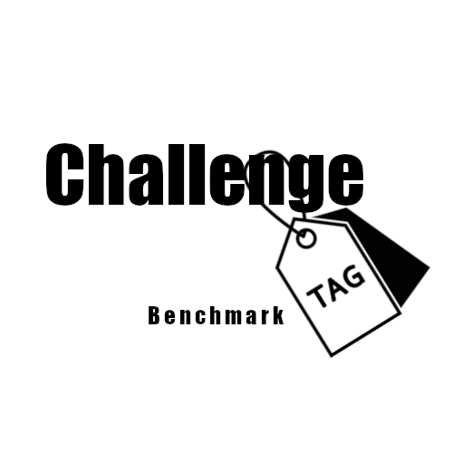

### Codabench bundle: Challenge Tagger

Layout:

- `competition.yaml`           — written by write_competition_yaml
- `pages/`                     — markdown pages referenced from competition.yaml
- `scoring_program/`           — score.py + metadata.yaml
- `ingestion_program/`         — (optional) ingestion.py + metadata.yaml
- `reference_data/`            — ground truth used by scoring program
- `input_data/`                — (optional) inputs given to a code submission
- `starting_kit/`              — files for participants to download
- `public_data/`               — (optional) publicly downloadable data
